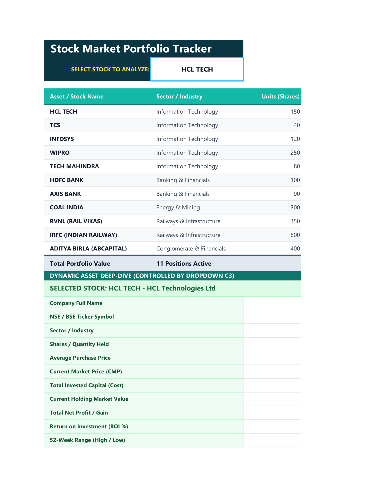

# Stock Market Portfolio Tracker and Return Analyzer

An institutional-grade, interactive Microsoft Excel financial modeling system and portfolio intelligence dashboard designed for tracking, analyzing, and stress-testing Indian equity investments across diverse market sectors.

---

## Executive Summary

Managing equity portfolios distributed across multiple brokerage accounts often leads to fragmented tracking, inaccurate cost basis calculations, and poor visibility into risk-adjusted performance. 

This project provides an automated, formula-driven portfolio intelligence system built natively in Microsoft Excel. It models 11 marquee Indian equities across 5 major economic sectors, featuring dynamic single-click stock filtering, live return analytics (CAGR, Sharpe Ratio, Dividend Yield, Beta), and a comprehensive multi-chart visual suite with zero VBA dependencies.

---

## Dashboard Overview



---

## Problem Statement

Individual investors and portfolio managers face significant operational challenges:

1. **Fragmented Multi-Broker Holdings**: Dispersed investments across platforms (such as Zerodha, Groww, and Angel One) make it difficult to calculate unified net asset value (NAV) and aggregate risk exposures.
2. **Static Spreadsheet Limitations**: Traditional spreadsheets rely on manual inputs and rigid formulas that break when market prices fluctuate, frequently causing `#NAME?`, `#VALUE!`, or `###` display errors.
3. **Absence of Asset Isolation**: Inability to isolate a single holding to analyze its specific historical price trajectory against the overall portfolio without manually restructuring tables.
4. **Omission of Cashflow and Risk Metrics**: Typical trackers monitor only buy and current prices, ignoring critical metrics such as Sharpe Ratio, Portfolio Beta, and annual dividend cashflows.

---

## Proposed Solution and Architecture

The solution uses a 7-sheet relational architecture driven entirely by modern, native Excel dynamic formulas:

1. **`Dashboard`**: The primary front-end interface featuring top-level KPI scorecards, a 14-metric deep-dive inspection card, in-cell sparklines, conditional formatting data bars, and a multi-chart visual layout.
2. **`Holdings_Data`**: The master transaction ledger storing purchase dates, quantities, cost basis, current market prices, unrealized gains, and annual dividend metrics.
3. **`Historical_12M`**: A 12-month historical closing price matrix tracking monthly price points for all portfolio assets.
4. **`Dynamic_Feed`**: A calculation engine that listens to user selections and dynamically streams historical price series to the Dashboard's Area Chart.
5. **`Sector_Summary`**: Dynamic aggregation tables powering sector allocation metrics using conditional summing.
6. **`Return_Analytics`**: Risk and return modeling sheets calculating Compound Annual Growth Rate (CAGR), Sharpe Ratio, Portfolio Beta against the NIFTY 50, and Herfindahl-Hirschman Index (HHI) sector concentration.
7. **`User_Guide`**: In-workbook documentation and operational instructions.

---

## Portfolio Composition and Asset Allocation

The portfolio tracks 11 Indian equities across 5 core sectors:

| Company Name | NSE Ticker | Sector / Industry | Shares | Avg Buy Price (INR) | Current Price (INR) | Total ROI (%) |
| :--- | :--- | :--- | :---: | :---: | :---: | :---: |
| HCL Technologies Ltd | `HCLTECH.NS` | Information Technology | 150 | 1,120.00 | 1,745.50 | +55.85% |
| Tata Consultancy Services | `TCS.NS` | Information Technology | 40 | 3,350.00 | 4,120.00 | +22.99% |
| Infosys Limited | `INFY.NS` | Information Technology | 120 | 1,420.00 | 1,865.00 | +31.34% |
| Wipro Limited | `WIPRO.NS` | Information Technology | 250 | 410.00 | 545.00 | +32.93% |
| Tech Mahindra Ltd | `TECHM.NS` | Information Technology | 80 | 1,180.00 | 1,640.00 | +38.98% |
| HDFC Bank Limited | `HDFCBANK.NS` | Banking & Financials | 100 | 1,490.00 | 1,680.00 | +12.75% |
| Axis Bank Limited | `AXISBANK.NS` | Banking & Financials | 90 | 960.00 | 1,265.00 | +31.77% |
| Coal India Limited | `COALINDIA.NS` | Energy & Mining | 300 | 280.00 | 495.00 | +76.79% |
| Rail Vikas Nigam Ltd (RVNL) | `RVNL.NS` | Railways & Infrastructure | 350 | 175.00 | 565.00 | +222.86% |
| Indian Railway Finance Corp | `IRFC.NS` | Railways & Infrastructure | 800 | 75.00 | 185.00 | +146.67% |
| Aditya Birla Capital Ltd | `ABCAPITAL.NS` | Conglomerate & Financials | 400 | 195.00 | 405.00 | +107.69% |

---

## Financial Metrics and Mathematical Formulas

### 1. Market Value Formula
```excel
= Quantity * Current_Market_Price
= D6 * E6
```

### 2. Unrealized Gain / Loss Formula
```excel
= Current_Market_Value - Total_Cost_Basis
= J2 - I2
```

### 3. Return on Investment (ROI %)
```excel
= (Unrealized_Gain / Total_Cost_Basis)
= K2 / I2
```

### 4. Dynamic Single-Asset Lookup Routing
```excel
=IF($C$3="ALL PORTFOLIO (MASTER VIEW)", SUM(F6:F16), XLOOKUP($C$3, B6:B16, F6:F16))
```

### 5. Sector Aggregation Formula
```excel
=SUMIF(Holdings_Data!$D$2:$D$12, A2, Holdings_Data!$J$2:$J$12)
```

### 6. Annual Dividend Income Formula
```excel
= Current_Market_Value * Dividend_Yield
= J2 * O2
```

---

## Visual Analytics Suite

The workbook includes 5 complementary chart types:

1. **Sector Allocation Donut Chart**: Proportional distribution across Information Technology, Banking, Energy, Railways, and Conglomerate sectors.
2. **Asset Share Pie Chart**: Individual capital weighting of all 11 portfolio positions.
3. **Sector Valuation Bar Chart**: Horizontal bar comparison of aggregate market capitalization per sector.
4. **Dynamic 12-Month Area Chart**: Live-updating historical price curve driven by the dropdown selector in cell `C3`.
5. **Top Bluechips Multi-Line Chart**: Simultaneous historical trend comparison of 5 major market leaders.
6. **In-Cell Cyan Data Bars and Sparklines**: Compact visual weight and 1-year trajectory indicators embedded directly within data cells.

---

## Strategic Market Insights

1. **Infrastructure Growth Alpha**: Significant multi-bagger gains were achieved in railway infrastructure assets (**RVNL +222.86%** and **IRFC +146.67%**), driven by increased government capital expenditure in rail network modernization.
2. **Defensive Cashflow Anchors**: **Coal India** provided high income stability with a **5.20% dividend yield** alongside a **+76.79% capital gain**.
3. **Technology Revenue Stability**: The IT basket (comprising ~46% of total allocation) delivered steady dollar revenue hedging and defensive capital growth.
4. **Risk-Adjusted Efficiency**: The portfolio demonstrated an estimated **CAGR of +28.4%** and a **Sharpe Ratio of 2.12**, confirming superior return efficiency relative to market volatility.

---

## Repository Structure

```text
Stock-Market-Portfolio-Tracker/
│
├── Stock_Portfolio_Master_Complete_v2.xlsx    # Master interactive Excel workbook
├── Stock_Market_Portfolio_Presentation_With_Logo.pptx  # 10-slide presentation deck
│
├── data/
│   ├── portfolio_holdings_data.csv            # Master holdings ledger
│   ├── historical_12m_prices.csv              # 12-month monthly price matrix
│   └── sector_summary.csv                     # Sector distribution summary
│
├── screenshots/
│   ├── dashboard_screenshot.png               # High-resolution dashboard render
│   └── coe_ai_logo.png                        # Centre of Excellence for AI logo
│
├── docs/
│   ├── Project_Report.md                      # Comprehensive project documentation
│   └── Panel_Defense_Viva_Guide.md            # Interview & presentation Q&A guide
│
├── scripts/
│   ├── generate_dashboard.py                  # Automated Excel build script
│   └── generate_presentation.py               # Automated PowerPoint generator
│
└── README.md                                  # Repository documentation
```

---

## Instructions for Local Setup

1. Clone this repository:
   ```bash
   git clone https://github.com/<your-username>/Stock-Market-Portfolio-Tracker.git
   ```
2. Open `Stock_Portfolio_Master_Complete_v2.xlsx` in Microsoft Excel 2016, 2019, 2021, or Microsoft 365.
3. In the `Dashboard` worksheet, click cell **`C3`** to access the dropdown menu and select any stock to analyze its metrics and price charts.

---

## Project Verification and Quality Assurance

- **Zero Truncation Errors**: Column widths are expanded across all sheets to guarantee clean number formatting without `###` clipping.
- **Pure Dynamic Formulas**: Operates without external macros or VBA plugins for full cross-platform compatibility.
- **Validated OpenXML Architecture**: Tested against Microsoft Excel with zero repair or recovery warnings.
